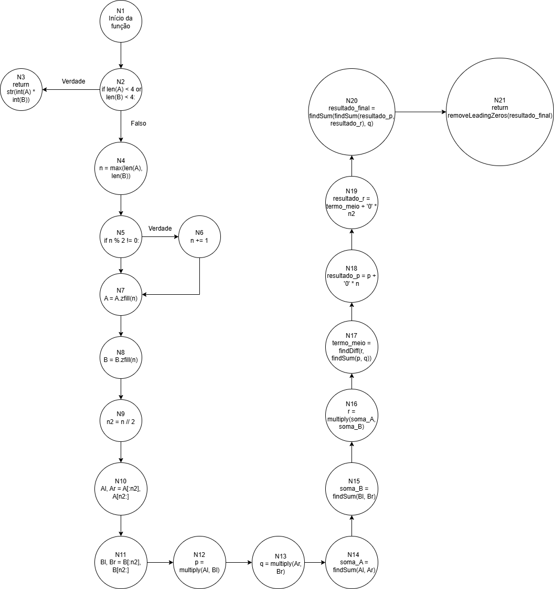

# Projeto de Fundamentos de Projeto e Análise de Algoritmos - Implementação do Algoritmo de Karatsuba em Python

## Sobre o Projeto
Este projeto consiste na implementação do algoritmo de Karatsuba em Python para a multiplicação eficiente de números inteiros grandes. O algoritmo de Karatsuba utiliza a estratégia de "dividir para conquistar" para realizar a multiplicação com uma complexidade assintótica melhor do que o algoritmo de multiplicação tradicional. Então, em vez de fazer uma multiplicação gigante, ele a transforma em três multiplicações menores e algumas somas.

### Lógica do Algoritmo Implementado
O código trata os números como texto (strings), para que se possa trabalhar com números gigantes sem limites. Basicamente, se os valores inseridos para multiplicar forem pequenos (com menos de 4 dígitos), o algoritmo converte os textos A e B em números, multiplica eles normalmente e retorna o resultado como texto. Esta é a condição de parada.

```
if len(A) < 4 or len(B) < 4:
        return str(int(A) * int(B))
```

Porém, se os números forem grandes, o algoritmo:
1. Verifica qual dos dois números tem mais dígitos e guarda esse valor na variável `n`. Se ele for ímpar, soma 1 a ele, tornando o par.
```
    n = max(len(A), len(B))
    if n % 2 != 0:
        n += 1
```
2. Depois, ele adiciona zeros à esquerda no número `A` e `B` até que os dois fiquem com o mesmo tamanho `n`. Isso simplifica a divisão dos números em duas metades de tamanho igual. Exemplo: 12345 e 6789 viram 012345 e 006789.
```
   A = A.zfill(n)
   B = B.zfill(n)
```
3. Calcula a metade do tamanho `n` e guarda em `n2`, o qual será o ponto de corte para gerar o resultado no fim.
```
  n2 = n // 2
```
4. Posteriormente, divide ambos ao meio. Exemplo: 012345 vira Al = "012" e Ar = "345".
```
    Al, Ar = A[:n2], A[n2:]
    Bl, Br = B[:n2], B[n2:]
```
5. Realiza 3 contas: multiplica as metades da esquerda dos dois números (p); multiplica as metades da direita (q); soma as metades de cada número inicial (soma_A e soma_B) e multiplica os resultados dessas somas (r).
```
    p = multiply(Al, Bl)
    q = multiply(Ar, Br)
    soma_A = findSum(Al, Ar)
    soma_B = findSum(Bl, Br)
    r = multiply(soma_A, soma_B)
```
6. Calcula o termo do meio do resultado (`r - p - q`).
```
   termo_meio = findDiff(r, findSum(p, q))
```
7. Para posicionar os resultados `p` e `r` corretamente, eles precisam ser "deslocados" para a esquerda, por isso, adiciona-se n zeros no final de cada string, organizando as casas decimais.
```
    resultado_p = p + '0' * n
    resultado_r = termo_meio + '0' * n2
```
8.  Soma os resultados das 3 contas (`p, r e q`) e retorna o resultado. Mas, antes de devolver a resposta final, ele usa a função `removeLeadingZeros` para limpar qualquer zero à esquerda que possa ter sobrado no processo.
```    
    resultado_final = findSum(findSum(resultado_p, resultado_r), q)
    return removeLeadingZeros(resultado_final)
```

### Como Executar o Projeto
#### Pré-requisitos:

Ter o Python 3 instalado. Especificamente, este projeto foi desenvolvido na versão 3.10.11 do Python.

#### Passos:

• Faça o download ou clone este repositório.

• Abra o terminal ou prompt de comando e navegue até a pasta onde você salvou os arquivos.

• Execute o programa com o seguinte comando:
```
python main.py
```

O resultado da multiplicação de exemplo aparecerá na tela. Para testar com outros números, basta editar as variáveis A e B no final do arquivo main.py.

### Explicação das funções
#### Arquivo main.py

• `multiply(A, B)`: função para multiplicar dois números usando o algoritmo de Karatsuba.

• `findSum(str1, str2)`: função para encontrar a soma dos maiores números representados como string.

• `findDiff(str1, str2)`: função para encontrar a diferença de maiores números representados como strings.

• `removeLeadingZeros(s)`: função para remover todos os zeros iniciais de uma string.

## Relatório Técnico
### Análise da complexidade ciclomática
Mede a quantidade de caminhos independentes em um código-fonte.

#### Fluxo de Controle do algoritmo de Karatsuba:

1. A função inicia.

2. Um if verifica se os números são pequenos (caso base).

3. Se for verdadeiro, a multiplicação direta é retornada e a função termina.

4. Se for falso, o código continua. Calcula n e n2, e adiciona zeros à esquerda dos números.

5. Os números são divididos na metade.

6. Três chamadas recursivas (p, q, r) são executadas.

7. O termo do meio é calculado.

8. Os resultados são combinados.

9. O resultado final é retornado e a função termina.

#### Estruturando o Grafo de fluxo:



Nós: 21
• N1: assinatura da função multiply.
• N2: condição `if len(A) < 4 or len(B) < 4.`
• N3: `return str(int(A) * int(B))`.
• N4: atribuição de n = max(len(A), len(B))
• N5: condição `if n % 2 != 0`.
• N6: atribuição de `n += 1`.
• N7: atribuição de A com zeros `A = A.zfill(n)`.
• N8: atribuição de B com zeros `B = B.zfill(n)`.
• N9: atribuição de n2 com metade do tamanho de n.
• N10: divisão de A na metade `Al, Ar = A[:n2], A[n2:]`.
• N11: divisão de B na metade `Bl, Br = B[:n2], B[n2:]`.
• N12: atribuição de p com multiplicação das metades da esquerda `p = multiply(Al, Bl)`.
• N13: atribuição de q com multiplicação das metades da direita `q = multiply(Ar, Br)`.
• N14: soma das metades de A `soma_A = findSum(Al, Ar)`.
• N15: soma das metades de B `soma_B = findSum(Bl, Br)`.
• N16: atribuição de r com multiplicação das somas `r = multiply(soma_A, soma_B)`.
• N17: atribuição do termo do meio como a diferença entre r-p-q `termo_meio = findDiff(r, findSum(p, q))`.
• N18: atribuição do resultado de p ao adicionar zeros à direita `resultado_p = p + '0' * n`.
• N19: atribuição do resultado de r ao adicionar zeros à direita `resultado_r = termo_meio + '0' * n2`.
• N20: atribuição do resultado final como a soma de p, r e q com suas devidas casas decimais completas `resultado_final = findSum(findSum(resultado_p, resultado_r), q)`.
• N21: retorno do resultado final sem zeros à esquerda `return removeLeadingZeros(resultado_final)`.

Arestas: 21
• N1 -> N2
• N2 -> N3
• N2 -> N4
• N4 -> N5
• N5 -> N6
• N5 -> N7
• N6 -> N7
• N7 -> N8
• N8 -> N9
• N9 -> N10
• N10 -> N11
• N11 -> N12
• N12 -> N13
• N13 -> N14
• N14 -> N15
• N15 -> N16
• N16 -> N17
• N17 -> N18
• N18 -> N19
• N19 -> N20
• N20 -> N21

#### Cálculo da complexidade ciclomática
𝑀 = 𝐸 − 𝑁 + 2𝑃
M = 21 - 21 + 2.1
M = 2

Portanto, a complexidade ciclomática da função multiply é 2. Isso significa que existem dois caminhos independentes no código, correspondentes ao caso base (quando os números são de tamanhos pequenos) e ao caso recursivo.

### Análise da complexidade assintótica
#### Complexidade Temporal:
Ela avalia quanto tempo um algoritmo leva para processar a entrada, em função do tamanho dessa entrada (𝑛).

A complexidade temporal, ou seja, o tempo total (T) para multiplicar dois números de n dígitos será igual ao tempo de fazer 3 multiplicações com números de metade do tamanho (n/2), mais um custo extra (O(n)) para as operações de soma, subtração e organização dos dados -> T(n)=3T(n/2)+O(n).

Isso dá uma complexidade de **O(n^1.585)**, o que é melhor do que O(n^2), que é o que algoritmos normais gastariam.

### Complexidade Espacial:
Ela avalia a quantidade de memória adicional necessária para executar o algoritmo. É determinada pela profundidade da pilha de recursão.

Como em cada chamada da recursão do algoritmo, se armazena variáveis temporárias (Al, Ar, p, q, etc.) e seus tamanhos são proporcionais ao tamanho da entrada naquela chamada (quantidade de dígitos), a complexidade espacial será **O(n)**, onde N é o tamanho da entrada.

#### Casos principais:
Como a execução do algoritmo de Karatsuba depende apenas do número de dígitos (n) dos operandos e o número de divisões e chamadas recursivas é o mesmo para quaisquer números de mesmo tamanho, então, a complexidade temporal é a mesma para todos os 3 casos. 

Ou seja, o melhor caso, caso médio e pior caso são **Θ(n^1.585)**.
